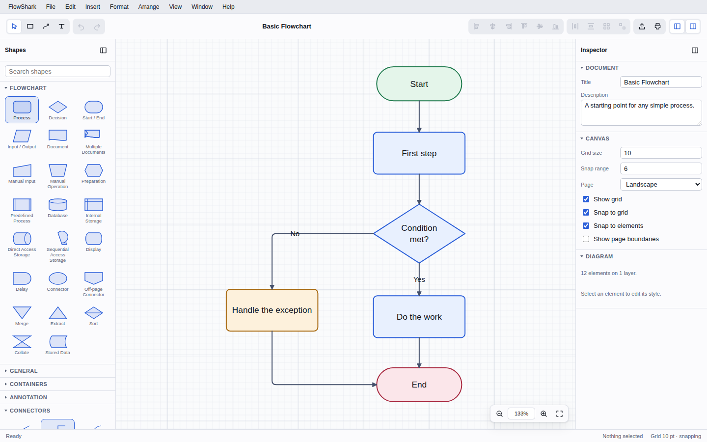
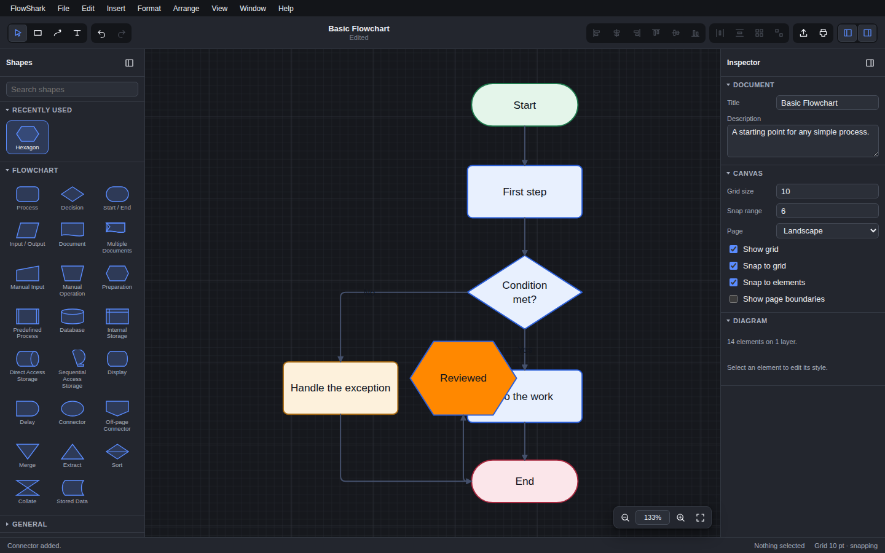
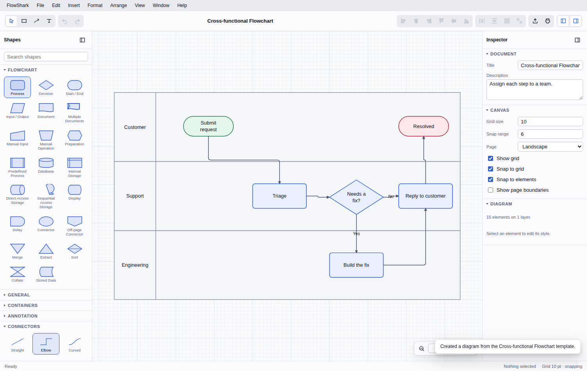

# FlowShark

A flowchart editor for macOS. FlowShark aims to be simple enough to draw a
process map in a couple of minutes and complete enough to produce diagrams you
would put in front of a client.



<details>
<summary>More screenshots</summary>

The same window in dark appearance:



The cross-functional flowchart template, with swimlanes:



</details>

- **Native-feeling.** A real macOS menu bar, the standard `⌘` shortcuts, the
  system Open and Save panels, live light and dark appearance, and Full Screen.
- **Complete shape library.** All 27 standard flowchart shapes plus 15 general
  shapes, containers, and annotations.
- **Connectors that behave.** Straight, elbow, curved, step, and freeform
  routes that stay attached and re-route when shapes move, with eleven
  endpoint styles and labels that travel along the line.
- **Layout tools.** Snap to grid, snap to nearby elements, alignment guides,
  equal-spacing detection, align, distribute, and size matching.
- **Real exports.** PNG, JPEG, WebP, SVG, and vector PDF — all drawn from the
  same geometry as the screen, so what you export is what you saw.
- **Fits the system.** Copy a diagram and Keynote takes the vector PDF while
  Mail takes the PNG; share it through the system share sheet; drag it
  straight out of the window into the Finder.
- **Yours alone.** No account, no telemetry, no cloud. Documents are plain
  JSON files on your Mac.

---

> **Scope.** FlowShark is built for personal and in-company use, not for public
> sale. That is why it ships as a signed DMG rather than through the Mac App
> Store, and why several decisions in [DECISIONS.md](DECISIONS.md) come down
> the way they do.

## Requirements

| | |
|---|---|
| macOS | 14 Sonoma or later |
| Mac | Apple Silicon (`arm64`) |

Intel Macs are not supported. See [DECISIONS.md](DECISIONS.md#d-001-apple-silicon-only)
for why, and for what it would take to add them back.

## Installing

See **[INSTALLATION.md](INSTALLATION.md)** for step-by-step instructions,
including building from a source download when no release DMG is available.

## Using FlowShark

See **[INSTRUCTIONS.md](INSTRUCTIONS.md)** for the full guide: drawing,
connecting, styling, laying out, exporting, and every keyboard shortcut.

The short version:

1. Drag a shape from the sidebar onto the canvas, or click one and then click
   where you want it.
2. Double-click a shape to type in it.
3. Press `⌘3`, then drag from one shape to another to connect them.
4. Select something and use the inspector on the right to change how it looks.
5. `⌘S` saves a `.flowshark` file; `⇧⌘E` exports a picture.

---

## Developing

### Prerequisites

- **Node.js 20 or later** and npm
- **Rust** (stable) with the `aarch64-apple-darwin` target
- **Xcode Command Line Tools** (`xcode-select --install`)

### Getting started

```bash
git clone https://github.com/johnjanney/flowshark-mac.git
cd flowshark-mac
npm install
npm run tauri:dev      # the real macOS application, with hot reload
```

`npm run dev` starts only the front end in a browser at
`http://localhost:1420`. That is useful for quick UI work and for the
automated tests; the browser build substitutes an in-app menu bar for the
system one and uses downloads in place of the Save panel.

### Everyday commands

| Command | What it does |
|---|---|
| `npm run dev` | Front end only, in a browser |
| `npm run tauri:dev` | The full macOS application |
| `npm run build` | Type-check and build the front end |
| `npm run tauri:build` | Build a signed `.app` and `.dmg` for `arm64` |
| `npm test` | Unit tests (Vitest) |
| `npm run typecheck` | TypeScript, no emit |
| `npm run smoke` | Drives the built app in headless Chromium |
| `npm run check:macos` | Type-checks the macOS-only Rust code from any platform |
| `npm run version:check` | Confirms all four version fields agree |
| `cargo test` (in `src-tauri`) | Tests for the Rust shell |

### How the code is organised

The layout follows the component list in the project brief, so a requirement
maps onto a directory.

```
src/
├── model/          Document model, geometry, serialisation, migrations
├── shapes/         Shape library: geometry, connection points, text boxes
├── connectors/     Anchors, routing, endpoint markers
├── text/           Measurement, line breaking, inline editing
├── commands/       Command registry, editing actions, undo and redo
├── state/          The application store
├── canvas/         Scene building, renderer, interaction, snapping
├── io/             Export (SVG, raster, PDF), import, PDF writer
├── templates/      Starter diagrams
├── platform/       Everything macOS-specific (the Platform Layer)
├── ui/             Toolbar, sidebar, inspector, menus, dialogs
└── app.ts          Wires it together and registers every command

src-tauri/          The macOS application shell (Rust)
```

Two rules hold the design together:

1. **One drawing path.** `src/canvas/scene.ts` turns a document into SVG, and
   the screen, the SVG export, the PNG export, and the PDF export all start
   from it or from the same geometry functions. An export cannot drift away
   from what you saw.
2. **One command registry.** Every action a user can take is registered in
   `src/app.ts`. The menu bar, the toolbar, the context menus, and the
   keyboard handler are all built from that registry, which is what keeps the
   brief's rule true: nothing is reachable by mouse that is not reachable by
   keyboard.

`src/platform/` is the only place that knows it is running inside a macOS
application. If the app is ever rewritten in Swift, that directory marks the
boundary of the work.

### The document format

A `.flowshark` file is JSON with an integer `schemaVersion`. Older documents
are migrated forward on load; a document written by a newer version of the app
is refused with an explanation rather than half-loaded. Nothing in a document
is ever executed, and embedded images are limited to formats the renderer can
actually draw.

The application version and the document schema version are independent. See
[VERSIONING.md](VERSIONING.md).

### Testing

- **Unit tests** (`npm test`) cover serialisation and migration, geometry,
  connector routing, undo and redo, the layout commands, snapping, text
  layout, accelerators, and the export output — including checking that a
  written PDF has valid cross-reference offsets and that exported SVG contains
  no scripts.
- **A smoke test** (`npm run smoke`) drives the real interface in headless
  Chromium: adding shapes, editing text, connecting, undoing, aligning,
  grouping, exporting, dropping an image, and reading the accessible outline.
  It fails on any console error and saves screenshots.
- **Rust tests** (`cd src-tauri && cargo test`) cover the atomic save and the
  temporary-file path used by Share and drag-out.
- **A macOS cross-check** (`npm run check:macos`) compiles
  `src-tauri/src/macos.rs` against the `aarch64-apple-darwin` target. That code
  is behind `#[cfg(target_os = "macos")]`, so an ordinary `cargo check` on
  another platform would skip it silently; this compiles it for real without
  needing a Mac, because checking never links.

### Releasing

Tag a commit `vMAJOR.MINOR.PATCH` and push it. The release workflow builds on
a macOS runner, signs with a Developer ID certificate, notarises, staples the
ticket, builds the DMG, and attaches it to a draft GitHub release. The
required repository secrets are listed in [VERSIONING.md](VERSIONING.md#ci-secrets).

---

## What is not here yet

FlowShark is at `0.1.0`. These are the notable gaps, all recorded with their
reasoning in [DECISIONS.md](DECISIONS.md) and tracked in
[CHANGELOG.md](CHANGELOG.md):

- No Quick Look preview or thumbnail for `.flowshark` files, and no Spotlight
  importer. These need separate Xcode targets inside the bundle, which Tauri
  does not create.
- No SVG import.
- Layers exist in the document model but there is no layers panel.
- Text is styled per element rather than per character.
- The toolbar has a fixed set of items.
- No automatic update mechanism.

## Licence

MIT. See [LICENSE](LICENSE).
